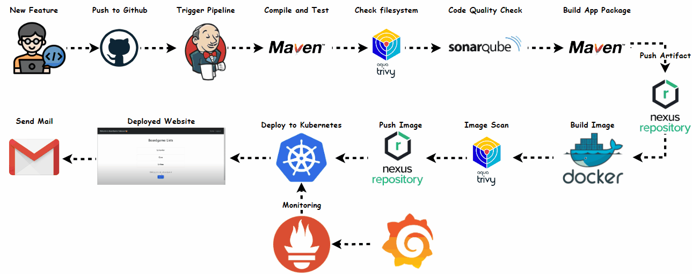

# BoardGame Project CI/CD Pipeline

This project demonstrates a CI/CD pipeline for a Java Maven application called BoardGame. The pipeline is implemented using Jenkins and incorporates several tools and stages to ensure code quality, security, and automated deployment.



## Pipeline Overview

The Jenkins pipeline performs the following steps:

1. **Compile Code**
   - Compiles the Java code using Maven.
   
2. **Test Code**
   - Runs the unit tests using Maven.
   
3. **Filesystem Scan**
   - Scans the filesystem using Trivy and generates an HTML report.
   
4. **SonarQube Analysis**
   - Runs static code analysis using SonarQube.
   
5. **Quality Gate**
   - Waits for the SonarQube quality gate result.
   
6. **Build Code**
   - Packages the application using Maven.
   
7. **Push to Nexus**
   - Deploys the Maven artifact to Nexus.
   
8. **Build & Tag Docker Image**
   - Builds and tags the Docker image.
   
9. **Docker Image Scan**
   - Scans the Docker image using Trivy and generates an HTML report.
   
10. **Push Docker Image to Nexus**
    - Pushes the Docker image to Nexus.
    
11. **Change Image Version in Kubernetes**
    - Updates the Kubernetes deployment YAML file with the new Docker image tag.
    
12. **Deploy to EKS Cluster**
    - Deploys the updated application to the EKS cluster.

## Environment Variables

- `SCANNER_HOME`: Path to the SonarQube scanner.
- `NEXUS_SERVER`: Nexus server address.
- `DOCKER_REGISTRY`: Docker registry URL.
- `IMAGE_TAG`: Docker image tag, typically the Jenkins build number.

## Tools and Technologies

- **JDK**
- **Maven**
- **Jenkins**: For Pipeline
- **SonarQube**: For static code analysis.
- **Trivy**: For filesystem and Docker image scanning.
- **Nexus**: For artifact and Docker image storage.
- **Docker**: For containerizing the application.
- **Kubernetes**: For deploying the application.
- **Prometheus,Grafana**: For Monitoring 


## Usage

### Terraform
1. Navigate to the `terraform_eks` directory and initialize Terraform
2. Apply the Terraform configuration to set up the EKS Cluster

### Set up Jenkins
1. Install the necessary tools and plugins in Jenkins.
2. Configure the environment variables and credentials.

### Run the Pipeline
Trigger the pipeline to start the build, test, scan, and deployment process.

### Check Reports
Review the Trivy reports and SonarQube analysis for any issues.

### Set up Monitoring Server
1. Install prometheus and Grafana
2. Import dashboards in Grafana

### Monitor Kubernetes Cluster with Prometheus

#### Install Node Exporter using Helm

1. Add the Prometheus Community Helm repository:

   ```sh
   helm repo add prometheus-community https://prometheus-community.github.io/helm-charts
   ```

2. Create a Kubernetes namespace for the Node Exporter:
   ```sh
    kubectl create namespace prometheus-node-exporter
    ```

3. Install the Node Exporter using Helm:

   ```sh
    helm install prometheus-node-exporter prometheus-community/prometheus-node-exporter --namespace prometheus-node-exporter
    ```

4. Add a Job to Scrape Metrics on nodeExporterIp:9100/metrics in prometheus.yml:

    Update your Prometheus configuration (prometheus.yml) to add a new job for scraping metrics from nodeExporterIp::9001/metrics. You can do this by adding the following configuration to your prometheus.yml file:

    ```sh
    - job_name: 'k8s'
        metrics_path: '/metrics'
        static_configs:
        - targets: ['nodeExporterIp:9100']
    ```